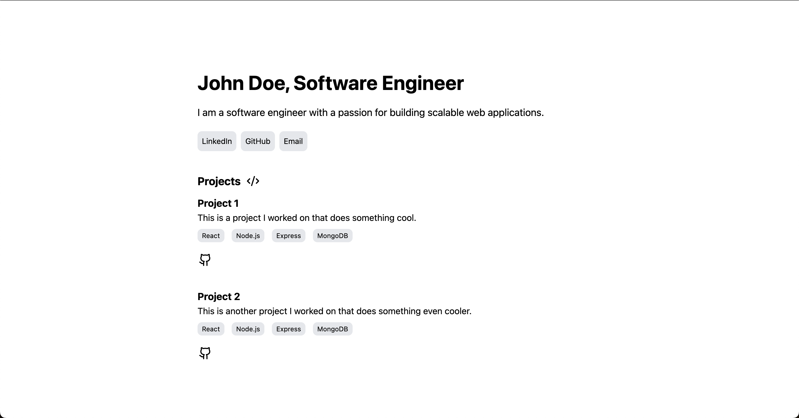

# Copy-Cat Portfolio Generator

A command-line tool that generates and deploys a professional portfolio website based on a simple JSON configuration.



## Features

- 🚀 One-command portfolio generation and deployment
- 📱 Responsive design out of the box
- 🔄 Automated GitHub repository creation
- 🌐 Instant deployment to Vercel
- 🎨 Clean, professional template design
- 🛠️ Customizable through JSON configuration

## Prerequisites

Before you begin, ensure you have the following:
- [Node.js](https://nodejs.org/)
- [Go](https://golang.org/doc/install)
- GitHub Account
- Vercel Account

### Setting up Access Tokens

#### GitHub Token
1. Visit [GitHub Token Settings](https://github.com/settings/tokens)
2. [Steps to set up Github token](https://docs.github.com/en/authentication/keeping-your-account-and-data-secure/managing-your-personal-access-tokens#creating-a-fine-grained-personal-access-token)

#### Vercel Token
1. Visit [Vercel Token Settings](https://vercel.com/account/tokens)
2. [Steps to set up vercel token](https://vercel.com/guides/how-do-i-use-a-vercel-api-access-token)

## Installation

```bash
# Clone the repository
git clone https://github.com/HaroldObasi/copy-cat.git

# Navigate to the project directory
cd copy-cat

# Install dependencies and build
go build

# move to bin
sudo mv copy-cat /usr/local/bin
```

## Usage

```bash
copy-cat -a my-portfolio -g YOUR_GITHUB_TOKEN -v YOUR_VERCEL_TOKEN -u user-info.json
```

### Command Flags

| Flag | Description | Required |
|------|-------------|----------|
| `-a, --appName` | Name of your portfolio app | Yes |
| `-g, --githubToken` | GitHub personal access token | Yes |
| `-v, --vercelToken` | Vercel personal access token | Yes |
| `-u, --userInfoPath` | Path to your user info JSON file | Yes |
| `-h, --help` | Display help information | No |

## JSON Configuration

Create a `user-info.json` file with your portfolio information:

```json
{
  "name": "John Doe",
  "jobTitle": "Software Engineer",
  "bio": "I am a software engineer with a passion for building scalable web applications.",
  "socials": [
    {
      "name": "LinkedIn",
      "url": "https://www.linkedin.com/in/johndoe"
    },
    {
      "name": "GitHub",
      "url": "https://www.github.com/johndoe"
    },
    {
      "name": "Email",
      "url": "mailto:johndoe@gmail.com"
    }
  ],
  "projects": [
    {
      "name": "Project 1",
      "description": "This is a project I worked on that does something cool.",
      "techStack": ["React", "Node.js", "Express", "MongoDB"],
      "github": "https://www.github.com/johndoe/project1"
    }
  ]
}
```

## How It Works

1. Reads your portfolio information from the JSON file
2. Generates a custom portfolio website using the provided template
3. Creates a new GitHub repository with your portfolio
4. Deploys the portfolio to Vercel automatically
5. Provides you with the deployment URL

## Example

```bash
# Generate and deploy a portfolio named "john-portfolio"
copy-cat -a john-portfolio -g ghp_123abc... -v vercel_token_123... -u ./john-info.json
```

## Contributing

Contributions are welcome! Please feel free to submit a Pull Request.

## Support

If you encounter any issues or have questions, please file an issue on the GitHub repository.